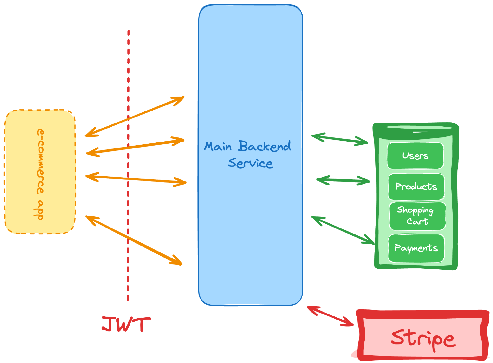
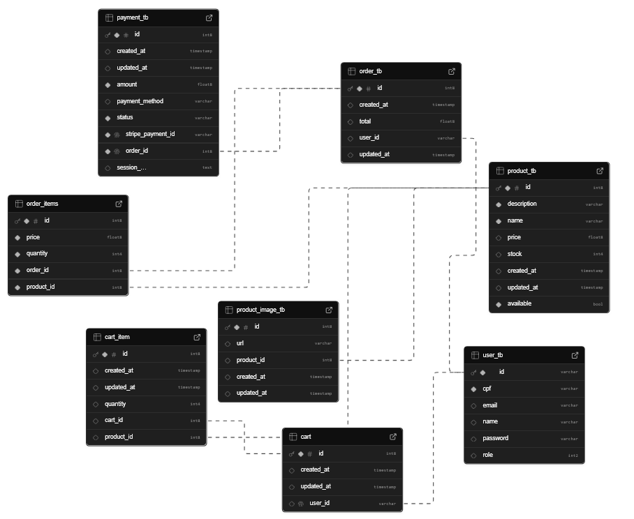

# 🛒 CloudCart - E-commerce REST API

<p align="center">
  
  
  
  
  
  
  
  
</p>

> Este projeto faz parte do [Desafio de E-commerce do Roadmap.sh](https://roadmap.sh/projects/ecommerce-api)
> Uma API REST robusta, escalável e moderna para e-commerce, construída com **Spring Boot**.

---

## 📜 Sumário

1. [Arquitetura da API](#-arquitetura-da-api)
2. [Diagrama do Banco de Dados](#-diagrama-do-banco-de-dados)
3. [Funcionalidades](#-funcionalidades)
4. [Tecnologias Utilizadas](#-tecnologias-utilizadas)
5. [Como Iniciar o Projeto](#-como-iniciar-o-projeto)
6. [Estrutura de Pastas](#-estrutura-de-pastas)
7. [Testes](#-testes)
8. [Seed de Dados](#-seed-de-dados)
9. [Segurança](#-segurança)
10. [Documentação da API](#-documentação-da-api)
11. [Banco de Dados](#-banco-de-dados)

---

## 🏛 Arquitetura da API

A arquitetura do **CloudCart** segue o padrão **Camadas (Layered Architecture)**, separando responsabilidades em:

* **Controller** → recebe e processa requisições HTTP.
* **Service** → concentra a lógica de negócios.
* **Repository** → comunicação com o banco de dados via Spring Data JPA.
* **Config** → configurações de segurança, autenticação JWT, integração com **Stripe** para pagamentos e **Cloudinary** para imagens.

> **Stripe** é utilizado no fluxo de **Checkout** para processar pagamentos com segurança, incluindo cancelamento e confirmação.
> O **Cloudinary** gerencia o upload e hospedagem de imagens dos produtos.

📌 **Diagrama da Arquitetura**





---

## 🗄 Diagrama do Banco de Dados

O banco foi modelado para suportar usuários, produtos, pedidos, pagamentos e carrinho de compras, com integridade referencial garantida via **PostgreSQL**.

📌 **Diagrama do Banco de Dados**





---

## ✨ Funcionalidades

* ✅ Autenticação segura com **JWT**
* 💳 Integração com **Stripe** para pagamentos online
* ☁️ Upload e gerenciamento de imagens com **Cloudinary**
* 🛍️ Carrinho de compras, pedidos, gerenciamento de estoque e produtos
* 🧾 Validação de entrada e tratamento centralizado de exceções
* ⚙️ Rotas administrativas exclusivas para admins
* 📦 API de Checkout com cancelamento de pagamentos
* 📈 Documentação interativa com **Swagger** (Admin & Public)

---

## 📚 Tecnologias Utilizadas

* **Java 17 + Spring Boot 3**
* **PostgreSQL** (via [Supabase](https://supabase.com))
* **Stripe API** para pagamentos
* **Cloudinary SDK** para imagens
* **JWT** para autenticação
* **MapStruct** para mapeamento de DTOs
* **Maven** como gerenciador de dependências

---

## 🚀 Como Iniciar o Projeto

```bash
# Clone o repositório
git clone https://github.com/seu-usuario/cloudcart.git

# Acesse o diretório
cd cloudcart

# Construa o projeto
./mvnw clean install

# Execute a aplicação localmente
./mvnw spring-boot:run
```

A aplicação estará disponível em:

```
http://localhost:8080
```

---

## 📂 Estrutura de Pastas

```plaintext
CloudCart/
├── src/
│   ├── main/
│   │   ├── java/com/liamfer/CloudCart/    # Código-fonte principal
│   │   └── resources/                     # Configurações e arquivos estáticos
│   └── test/                               # Testes de integração
├── pom.xml
├── README.md
├── mvnw / mvnw.cmd
└── LICENSE
```

---

## 🧪 Testes

Este projeto utiliza **testes de integração** com `@SpringBootTest` e `MockMvc`, garantindo que o comportamento real da aplicação seja validado com o contexto Spring carregado e integração com o banco de dados em memória ou de teste.

Os testes verificam:

* **Fluxo CRUD completo de produtos** (criação, listagem, atualização e exclusão)
* **Requisições autenticadas com JWT**
* **Respostas JSON** → estrutura, propriedades e conteúdo esperado
* **Rotas protegidas** e permissões de administrador
* **Cenários de erro** e exceções tratadas

📌 **Execução dos testes**

```bash
./mvnw test
```

> 💡 Garanta que o banco de dados de teste esteja configurado no
> `application.properties` ou `application-test.properties`.

---

## 🌱 Seed de Dados

Para testes rápidos, o **Seeder** popula o banco automaticamente com:

* 👤 **2 usuários** → admin e padrão
* 📦 **10 produtos** de exemplo

**Executando o seed:**


```bash
./mvnw spring-boot:run -Dspring-boot.run.arguments=--seed
```
> ⚠️ O seed **só é executado** se os repositórios de usuários e produtos estiverem vazios.
### 👥 Usuários criados automaticamente

| Tipo   | Email                                     | Senha  |
| ------ | ----------------------------------------- | ------ |
| Admin  | [admin@email.com](mailto:admin@email.com) | 123456 |
| Padrão | [user@email.com](mailto:user@email.com)   | 123456 |


---

## 🔐 Segurança

* Rotas protegidas exigem **token JWT** no header `Authorization: Bearer <token>`
* **Admins** → podem gerenciar produtos, usuários e pedidos
* **Usuários padrão** → só acessam seus próprios pedidos, perfil e carrinho

---

## 📘 Documentação da API

Acesse no navegador:

```
http://localhost:8080/swagger-ui/index.html
```

---

## 📦 Banco de Dados

O **PostgreSQL** é utilizado via **Supabase**, garantindo escalabilidade e alta disponibilidade.
As credenciais e URL de conexão podem ser configuradas no `application.properties`.

